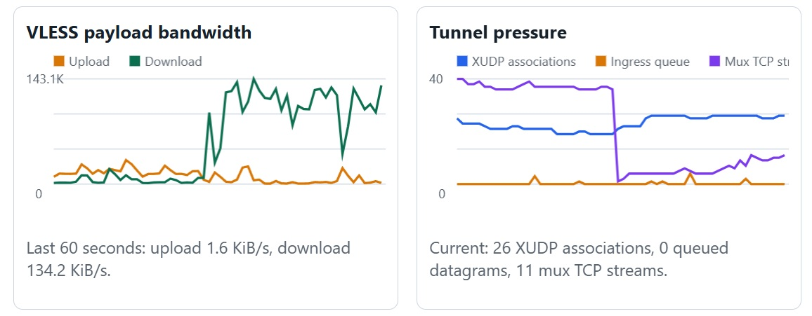
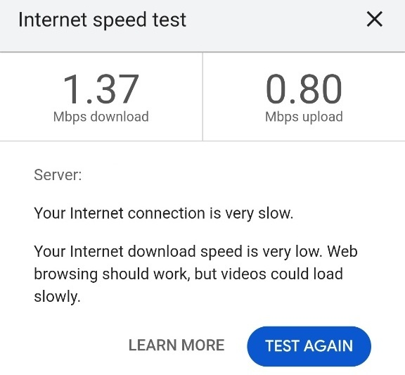

# ESP32-S3 VPN Transparent Proxy Router

[](LICENSE)

ESP-IDF firmware for ESP32-S3 R8N16 and R8N8 boards that provides a Wi-Fi access point, DHCP, DNS handling, and a fail-closed VLESS transport path for connected IPv4 clients. Clients do not need proxy settings.

Read [Architecture](docs/ARCHITECTURE.md), [Security policy](SECURITY.md), and [Contributing](CONTRIBUTING.md) before deployment or modification.

## Supported boards

Use `esp32s3_r8n16` for 16 MB flash boards and `esp32s3_r8n8` for 8 MB flash boards. Both targets assume 8 MB PSRAM.

ESP-IDF configuration is layered: `sdkconfig.defaults` holds the shared router and performance settings, while `sdkconfig.defaults.r8n8` and `sdkconfig.defaults.r8n16` contain only the flash size and matching partition-table selection. PlatformIO writes the generated full configuration to ignored `sdkconfig.build.*` files, so it does not drift into source control.

Example boards:

- [Waveshare ESP32-S3 Mini Development Board](https://www.waveshare.com/esp32-s3-zero.htm?sku=33879) for the `esp32s3_r8n8` target
- [ESP32 S3 N16R8 development board on AliExpress](https://www.aliexpress.us/item/3256809025806555.html?spm=a2g0o.productlist.main.1.138a5pUA5pUATW&algo_pvid=eccc07a0-1e62-40ea-bdb2-b6e0ce1ea5da&algo_exp_id=eccc07a0-1e62-40ea-bdb2-b6e0ce1ea5da-0&pdp_ext_f=%7B%22order%22%3A%22155%22%2C%22eval%22%3A%221%22%2C%22fromPage%22%3A%22search%22%7D&pdp_npi=6%40dis%21USD%217.25%210.99%21%21%2148.65%216.67%21%400b0b306117868510852743969e0e2d%2112000048328747394%21sea%21US%210%21ABX%211%210%21n_tag%3A-29910%3Bd%3A5e409eaf%3Bm03_new_user%3A-29895%3BpisId%3A5000000210792318&curPageLogUid=MVNb3ARAQYGn&utparam-url=scene%3Asearch%7Cquery_from%3A%7Cx_object_id%3A1005009212121307%7C_p_origin_prod%3A) for the `esp32s3_r8n16` target

Verify the board's flash and PSRAM sizes before flashing, and adjust `RGB_LED_GPIO` if the vendor uses a different WS2812 data pin.

## Performance snapshots

Bandwidth and tunnel-pressure charts:



Google speed test chart:



## Language and runtime

The packet path is written in C rather than C++. ESP-IDF and the custom lwIP hooks are C-first APIs; C also avoids C++ runtime initialization, exception support, and implicit dynamic-allocation behavior in the latency-sensitive packet path. C++ can be added for isolated non-packet-path components later, but new router-path code should remain compatible with ESP-IDF C and use bounded allocations.

## Current specifications

- AP with DHCP at configurable `/24` gateway `192.168.X.1` (factory default `192.168.4.1`, factory name `ESP32-VLESS-Setup`)
- Captive-DNS setup portal at the configured AP gateway (factory default `http://192.168.4.1`)
- Factory DNS resolver: `one.one.one.one` (no first-time DNS entry required)
- Independent configuration of upstream Wi-Fi and VLESS credentials
- Pasteable `vless://UUID@HOST:PORT?encryption=none&type=tcp` input
- Router Wi-Fi (AP) name/password/gateway configuration is on the main portal at the configured AP gateway
- Persisted settings in NVS; saved UUID and passwords are never returned to the portal
- Yellow RGB boot indication: two pulses over one second, then steady green = transparent VLESS router with an upstream IP, yellow = VLESS mode while the upstream is unavailable, cyan = transparent upstream-only router with an upstream IP, or blue = upstream-only mode while the upstream is unavailable. A short BOOT click toggles between transparent VLESS and transparent upstream-only modes for this boot.
- Hold BOOT for one second to enter configuration mode for the current boot. It disconnects the upstream Wi-Fi, restores the setup AP, and keeps the portal available at the configured gateway; the RGB LED blinks yellow. Saving an upstream profile exits configuration mode and reconnects.
- Hold BOOT for five seconds to erase configuration and reboot; the RGB LED turns red during the final second
- Internal SOCKS5 listener on the configured AP gateway at port `1080`, supporting TCP CONNECT to domain names
- VLESS TCP transport verified in hardware.
- Custom lwIP IPv4 TCP interception and reply-tuple rewriting for AP clients
- Direct VLESS XUDP framing is implemented and the configured server passed `GET /api/test-xudp` with an upstream DNS query.
- Persistent transparent IPv4 UDP relay verified in hardware: non-local datagrams are intercepted, sent as direct VLESS XUDP, and replies have their original tuple restored. Subsequent datagrams use XUDP Keep frames on the existing VLESS stream. DHCP and the router's local DNS remain local.
- Lock-protected transparent-flow table with immediate completion cleanup and a 30-second idle-flow maintenance sweep
- Transparent port-80 HTTP tested in hardware: an ordinary TCP connection to a Google IP, with no SOCKS/proxy handshake, was relayed as `google.com` through VLESS and returned HTTP `301`.
- VLESS-aware DNS-over-TCP forwarding with a 64-entry A-record cache, so browser-originated captured connections can use the requested domain rather than exposing a direct DNS query.
- TLS ClientHello SNI extraction for transparent TCP domain requests, verified in hardware with a Google HTTPS request.

## Compatibility matrix

| Capability | Status | Notes |
| --- | --- | --- |
| Plain VLESS over TCP | Supported | `encryption=none`, raw TCP transport only. |
| Transparent IPv4 TCP | Supported with limits | Uses domain recovery from DNS, HTTP Host, or TLS SNI when available. |
| Direct VLESS XUDP | Supported | Persistent UDP associations with bounded ingress. |
| sing-box smux | Experimental | Shared TCP/UDP session; enabled explicitly in the portal. Hardware burst reached 30/32 HTTP replies after the receive-buffer fix. |
| TLS / Reality / WebSocket VLESS | Unsupported | Do not configure these profiles. |
| IPv6 | Disabled | Fail-closed until full tunnel support exists. |
| Portal authentication | Supported with limits | HTTP Basic authentication protects every portal and diagnostic route. HTTPS is not available. |
| NVS encryption | Unsupported | Configuration secrets and the administrator password hash remain readable from physical flash access. |

## Supported VLESS profile

Only this profile is currently supported:

```text
vless://UUID@HOST:PORT?encryption=none&type=tcp#profile-name
```

TLS, Reality, and WebSocket are not implemented. IPv6 is explicitly disabled as a fail-closed policy until it can be tunneled correctly. The portal's **Enable sing-box smux multiplex transport** setting is off by default: when enabled, captured TCP streams and persistent UDP associations share a VLESS TCP connection to sing-box's `sp.mux.sing-box.arpa:444` endpoint using sing-mux v0/smux v1 framing. A single manager owns that socket, serializes frame writes, and demultiplexes replies into bounded per-client queues. Enable it only on a server with sing-box multiplexing enabled; disable it to retain direct per-stream VLESS TCP and direct VLESS XUDP associations. The existing `GET /api/test-xudp` check validates direct XUDP framing.

## Build, flash, and configure

```text
pio run -e esp32s3_r8n16
pio run -e esp32s3_r8n16 --target upload --upload-port COM15
pio run -e esp32s3_r8n8
pio run -e esp32s3_r8n8 --target upload --upload-port COM15
```

Set `monitor_speed = 115200` in `platformio.ini` for the serial monitor.

The portal status area shows the Git revision embedded in the firmware. A
`-dirty` suffix means the build tree contained staged, unstaged, or untracked
changes when it was compiled.

The portal requires HTTP Basic authentication. Its factory credentials are
`admin` / `changeme`. Change the password in the portal's administrator section
immediately after the first sign-in. The password is stored only as a SHA-256
hash in NVS and is not returned by the portal API.

The USB/UART console at 115200 is a physical-access recovery interface and does
not require portal authentication. Enter `help` to list its commands. `status`
reports the saved non-secret configuration and whether smux is enabled. The
console can configure the upstream Wi-Fi (`wifi`), router AP (`ap`), AP gateway
IP (`apip`), VLESS profile (`vless` or `vless-uri`), DNS resolver (`dns`),
multiplexing (`mux`), and portal password (`admin`). It never prints saved
passwords or the VLESS UUID.

After flashing, join the setup AP and visit the AP gateway at `http://192.168.4.1` by default. Configure the router AP, downstream subnet by setting the ESP32 gateway IP, upstream Wi-Fi, and VLESS profile independently. Do not commit a configured `sdkconfig`, NVS dump, URI, UUID, or Wi-Fi password to a public repository.

For browser-only flashing, every build creates a target-specific image such as `dist/esp32-vless-router-esp32s3_r8n16.bin` or `dist/esp32-vless-router-esp32s3_r8n8.bin`. Follow [Browser-based flashing](docs/WEB_FLASHING.md) to program the image matching your board at address `0x0` using esptool-js. This full image installs the target's OTA partition table and can clear saved configuration; record the router settings first.

Every build also creates a matching OTA image such as `dist/esp32-vless-router-esp32s3_r8n16-ota.bin` or `dist/esp32-vless-router-esp32s3_r8n8-ota.bin`. After installing a full image with the dual-slot layout once, sign in to the portal and use **Firmware update** to upload the application-only OTA image for that same board target. The update is streamed into the inactive slot, validated by ESP-IDF, selected for the next boot, and then the router reboots. OTA uploads require portal authentication, preserve NVS configuration, and must only use a trusted image built for this board. Do not upload the full `0x0` web-flash image through the portal.

For distribution, the post-build step also writes a target-specific archive such as `dist/esp32-vless-router-esp32s3_r8n16-git-<hash>[-dirty].zip` or `dist/esp32-vless-router-esp32s3_r8n8-git-<hash>[-dirty].zip`. It contains both binary images and `WEB_FLASHING.md`; the Git suffix matches the version displayed by the portal.

Normal packet-by-packet relay logs are disabled by default. For temporary traffic diagnostics, add `-DVLESS_TRAFFIC_LOGS=1` to `build_flags` in `platformio.ini`, then rebuild and flash.

The built-in single-pixel WS2812 RGB LED is driven on GPIO48 by default. If a board revision uses a different data pin, add `-DRGB_LED_GPIO=<pin>` to `build_flags` in `platformio.ini`.

For a strict no-direct-DNS deployment, configure the resolver as a numeric address such as `1.1.1.1`. A resolver hostname such as `one.one.one.one` works and its DNS queries are sent over VLESS after connection, but the ESP-IDF network stack may use the upstream network once to resolve that hostname before opening the VLESS stream.

## Current transparent-routing limits

- TCP interception is IPv4-only and has a 60-flow table with a two-minute idle expiry. The lwIP socket pool is configured for 120 sockets and 128 active TCP PCBs; a transparent stream consumes a client-side and VLESS-side TCP PCB. ESP-IDF reserves six VFS descriptors, so 120 is the safe maximum under its 128-descriptor select limit. Relay-task stacks are allocated from PSRAM, leaving internal RAM for Wi-Fi/lwIP. TCP receive and accept queues are 32 entries, Wi-Fi has 64 dynamic RX buffers, and the DHCP server supports 16 stations.
- UDP has a 128-flow table, a maximum 2048-byte client datagram, and a 56-association pool. One manager task owns all associations and a 160-entry ingress queue, avoiding one FreeRTOS task stack per client. With multiplex disabled, each active association keeps one direct-XUDP VLESS stream and uses XUDP Keep frames for later packets. With sing-box smux enabled, all UDP associations and up to 60 captured TCP streams share one VLESS TCP session; each association/connection is an smux stream with a separately demultiplexed request/response sequence. TCP uses a 96-entry control queue, 12-frame per-stream downstream queues, and a 128 KiB shared PSRAM reassembly buffer.
- The XUDP manager performs bounded per-stream frame demultiplexing: TCP-split and coalesced VLESS/XUDP frames are buffered until complete, then validated against the association's remote tuple before delivery. The portal shows active XUDP associations, ingress queue depth, and dropped datagrams. During overload it waits two milliseconds for queue capacity, then drops UDP rather than blocking unrelated traffic; pressure warnings are rate-limited.
- The portal updates those XUDP counters and VLESS payload bandwidth once per second. It retains a browser-local 60-second history and draws bandwidth plus tunnel-pressure charts (XUDP associations, ingress queue depth, and shared-smux TCP streams). Reloading the portal starts a new history.
- Bandwidth reports total payload bytes and the current upstream/downstream rate; VLESS request/frame overhead is intentionally excluded. The live summary also reports mux session state and its control-queue depth.
- The router supports XUDP frame fragmentation across the TCP tunnel, not IPv4 packet-fragment interception from clients. Modern QUIC endpoints normally use 1200–1350-byte datagrams, well within the 2048-byte envelope. Client-originated IPv4 fragments remain unsupported.
- Link-local multicast and broadcast UDP (for example mDNS and WS-Discovery) is dropped before it reaches the XUDP queue. It cannot be meaningfully routed through the remote endpoint and would otherwise starve Internet-facing UDP traffic.
- Verified transparent traffic is HTTP on port 80. The relay extracts its `Host` header and uses a VLESS domain request because the configured server did not return data for the raw IPv4 VLESS request used in testing.
- Other TCP destinations currently fall back to raw IPv4 VLESS requests and are not yet validated.
- When no DNS resolver hostname is configured or the VLESS upstream is unavailable, DNS deliberately remains captive-portal-only rather than leaking direct DNS upstream.

## Release readiness and remaining work

This repository is public and buildable, but it is not yet appropriate for an untrusted or unattended production deployment. Complete the unchecked items below before describing a release as production-ready.

- [x] VLESS-aware DNS forwarding/cache for IPv4 A records, with fail-closed captive-DNS fallback.
- [x] DNS cache for transparent flows; ClientHello SNI parsing supplies a fallback domain source for TLS.
- [x] End-to-end DNS, HTTP, and HTTPS/SNI regression test.
- [x] Connection-table locking, flow limits, and fail-closed kill switch for IPv4 TCP. IPv6 is disabled until tunnel support exists.
- [x] Direct VLESS XUDP compatibility probe against the configured sing-box endpoint, plus bounded transparent UDP DNS-style request/response relay. It does not forward UDP directly to the Wi-Fi upstream.
- [x] Persistent XUDP association management, bounded XUDP frame demultiplexing/reassembly, and ingress back-pressure. Client-originated IPv4 fragments remain fail-closed.
- [x] sing-box smux transport for persistent UDP associations and captured transparent TCP streams, including sing-mux session negotiation, smux stream IDs, single-owner frame serialization, bounded TCP downstream queues, frame demultiplexing, and reconnect notification. The portal stores an explicit enable/disable switch; it defaults off for compatibility.
- [ ] Validate the shared TCP smux path under a host 40-stream burst and long-running mixed TCP/UDP traffic; direct VLESS remains the recovery path when multiplexing is disabled.
- [x] IPv6 fail-closed policy: disabled until tunnel support exists.
- [ ] Encrypted NVS for deployment.
- [x] ESP-IDF 32-stream transparent HTTP burst: 32 connections opened; 30 HTTP responses completed through shared smux after the 64 KiB shared receive-buffer change.
- [ ] Make the 32-stream shared-smux burst consistently pass, then run a 60-flow host stress test plus throughput, reconnect, and multi-client soak tests.
- [ ] Add encrypted NVS, signed release artifacts, and a documented recovery/upgrade procedure.

**Important:** transparent TCP is now implemented only for the limited case described above; it is not yet a complete general-purpose VPN router. Ordinary client traffic is not NATed directly to upstream Wi-Fi, so it does not leak outside VLESS.
